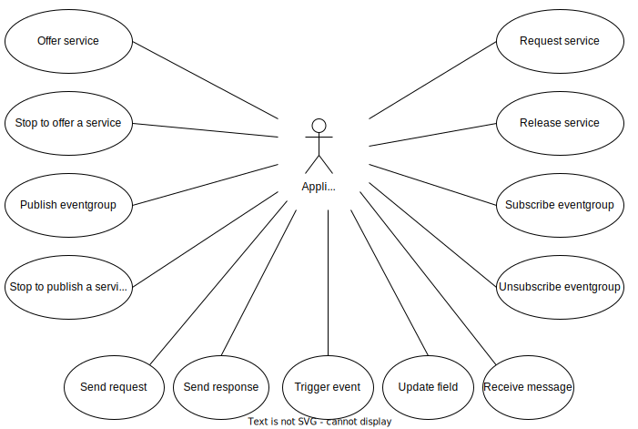
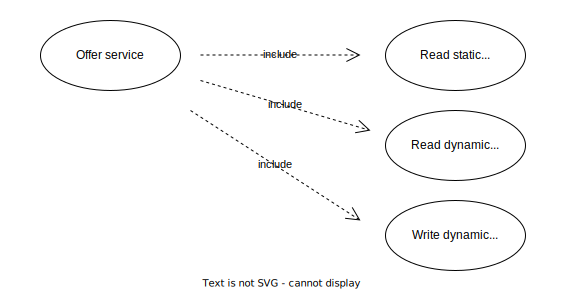

# Multicast

To use IP Multicast, the route must be added.
This is needed to define a network route and enable boardnet (external) communication.
In Linux this can be done by:

```bash
ip route add 224.0.0.0/4 dev eth0
```

Other OSes may have different ways to do this.

## Diagrams

### Use cases Overview



### Use case Offer service



### Sequence Offer service


