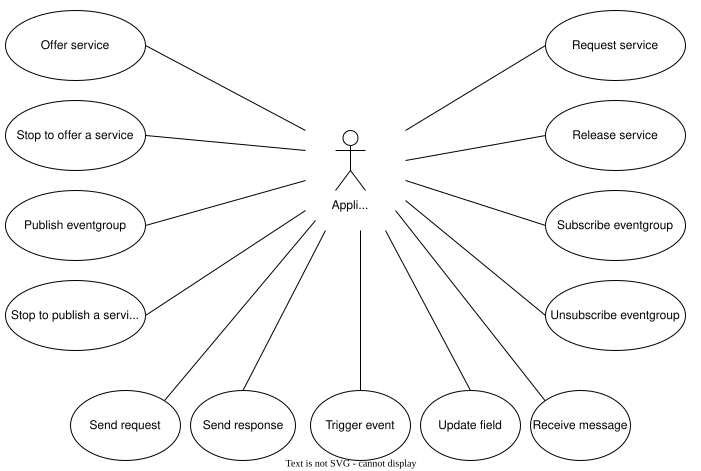
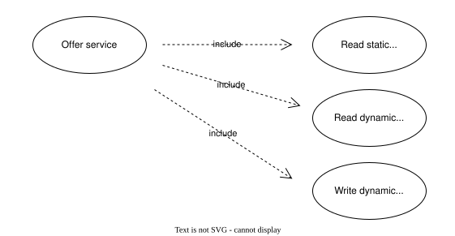
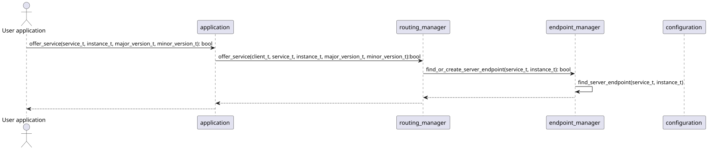

# Multicast

To use IP Multicast, the route must be added.
This is needed to define a network route and enable boardnet (external) communication.
In Linux this can be done by:

```bash
ip route add 224.0.0.0/4 dev eth0
```

On macOS, IPv6 multicast uses an interface index (scope id). vSomeIP derives
that index from the configured unicast address or from the `device` field in
the JSON configuration. Link-local and site-local groups without a scope
(`ff02::…`, `ff05::…`) will not join or send until an interface is known.

Other OSes may have different ways to do this.

## Diagrams

### Use cases Overview



### Use case Offer service



### Sequence Offer service


