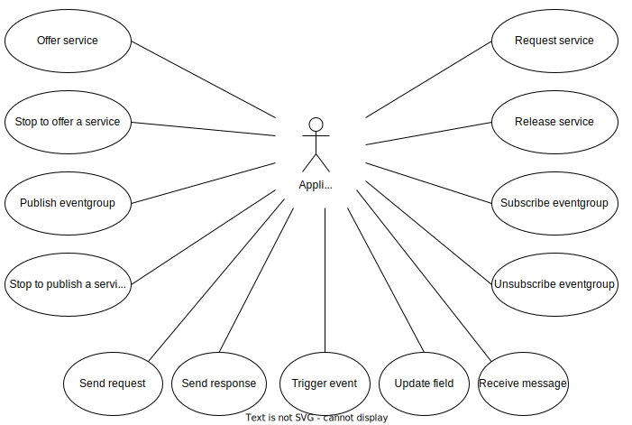
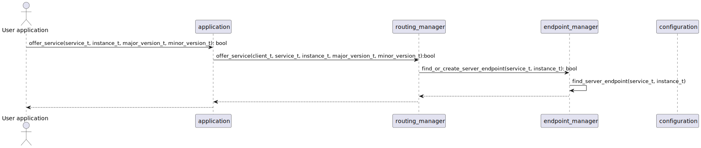

# Multicast
To use IP multicast, the route must be added. In Linux this can be done
by:

```
# route add -net 224.0.0.0/4 dev eth0
```

Other OSes may have different ways to do this.

# Diagrams
## Use cases Overview



## Use case Offer service


## Sequence Offer service



# Support and review
## Open and closed points
- [ ] update the EA model to match the current implementation
