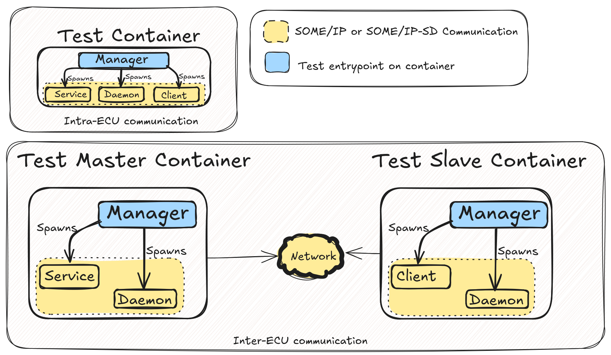

# VSOMEIP Common Testing Framework

This framework provides utilities for creating uniform, multi-process tests
for VSOMEIP-based applications.

The core pattern involves a **Manager** process that orchestrates child
processes and synchronizes key execution points in the test scenario.
Communication and synchronization are achieved through a shared memory segment.

## Common Organization

For a typical `FEATURE`, there is a `"$FEATURE"_tests/` folder. I.e., for FEATURE=request_debounce:

```bash
request_debounce_tests/
├── CMakeLists.txt
├── conf
│   ├── request_debounce_test_client.json.in
│   ├── request_debounce_test_service.json.in
├── request_debounce_test.md
├── request_debounce_test_client.cpp
├── request_debounce_test_common.hpp
├── request_debounce_test_service.cpp
├── request_debounce_test_manager.cpp
└── docs
    ├── request_debounce_test_client.png
    ├── request_debounce_test_client.puml
    ├── request_debounce_test_service.png
    └── request_debounce_test_service.puml

```

Of note:

- **`docs/`**: joins all artifacts related to documentation sans the markdown;
- **`conf/`**: Defines the configuration for VSOMEIP applications;
- **`"$FEATURE"_test.md`**: Explains the test logic and rationale, linking
  available documents if needed.

The rest are typical C++ artifacts using CMake as a build system. Note that the
expected entrypoint for this case is the executable generated from `request_debounce_test_manager.cpp`.

In general, the following kind of tests exist:

- Intra-ECU communication, where only the master container is relevant.
- Inter-ECU communication, where there must be a manager instance in each
  container, and a network configuration standard for both containers.



## Key Components

### shared_memory_t (common/interprocess.hpp)

Used for synchronization between the manager and child processes. The manager
(master, `shared_memory_master_t`) creates the shared memory segment and tracks
the state of all participants. Child processes (slaves, `shared_memory_slave_t`)
connect to this segment to coordinate their actions at specific points in the
test flow.

*Only one master should be created*. Many slaves *can* be created without
issues, provided the instance on the master has already been created.
Regardless of variant, a common name which designates the shared memory block
must be given.

```c++
// common.hpp
static const char* shm_name = "SHM_FOR_TEST";
enum class state_t {
    VARIANT_1,
    VARIANT_2,
    // ...
};
// Manager process, must specify number of processes, including the master.
auto shm = shared_memory_master_t<state_t>(shm_name, 3);
// Child process
auto shm = shared_memory_slave_t<state_t>(shm_name);
```

#### Usage Overview

When creating the master shared memory, you must specify the expected number
of processes (including the manager itself). This ensures that synchronization
primitives, such as barriers and channels, are correctly sized for the test scenario.

### barrier

The `barrier` is a synchronization primitive built on top of `shared_memory_t`.
It ensures that all participating processes (as specified during master
creation) reach a certain execution point before any are allowed to proceed.
This is essential for coordinating steps in multi-process tests, preventing
race conditions and ensuring deterministic test flow.

### bounded_channel

The `bounded_channel` is another primitive that leverages `shared_memory_t`
to provide a message-passing mechanism from child processes to the manager.
It allows child processes to send status updates or results, which the manager
can receive and process in a controlled, thread-safe manner. The channel is
bounded, meaning it has a fixed capacity, and is sized according to the number
of processes specified at shared memory creation.

### process_group_t (common/process.hpp)

Used to manage the lifecycle of multiple external processes in a test scenario.
`process_group_t` allows you to define process types (with associated
executables and environment setup), add processes to the group, and control
their startup and shutdown in a uniform way. This abstraction simplifies
orchestration of multi-process test setups, ensuring consistent environment
and lifecycle handling across all test participants.

#### Key Features of process groups

- **Type Definition**: Register process types with custom executables and
    environment variable setup logic.
- **Process Addition**: Add named processes of a given type to the group,
    optionally customizing their environment.
- **Daemon Support**: Special support for adding "daemon" processes with
    configuration files.
- **Lifecycle Management**: Start individual processes or all at once, and
    ensure proper shutdown and cleanup.

#### Example Usage of a process group

```c++
// Define a process group
common::process_group_t group;

// Register a new process type
group.define_type("client", "/path/to/client_executable", [](auto& env) {
    env["CUSTOM_ENV"] = "value";
});

// Add processes
group.add_process("client1", "client");
group.add_daemon("routing_daemon", "routing_config.json");

// Start all processes
group.start();

// ... run tests ...

// Stop all processes (automatically called in destructor)
group.stop();
```

### test_scenario_t (common/scenario.hpp)

`test_scenario_t` provides a structured way to define and execute ordered,
synchronized test steps in a single process. It ensures that each step in a
test scenario is executed in a specific order, with synchronization at each
step via shared memory.

#### Limitation: Scenario Specificity

Each test scenario must be manually revised by the test writer for every
process involved in a test. This means that a scenario is specific to a single
VSOMEIP application and cannot be directly reused across multiple VSOMEIP
processes without manual adaptation. Test writers should ensure that scenarios
are appropriately tailored for each application context to maintain test
accuracy and relevance.

#### Key Features of Scenario definition

- **Step Definition**: Steps are defined with a name and an action
    (function/lambda). Steps can be added sequentially or at specific indices
    using the `Steps` enum.
- **Synchronization**: Each step is synchronized using a shared memory object
    (`shared_memory_t`), ensuring all processes reach the same execution point
    before proceeding.
- **Fixed Scenario Size**: The number of steps is fixed at construction,
    enforcing scenario consistency.

#### Example Usage of scenario

```c++
// Define a scenario with 3 steps
common::test_scenario_t<state_t> scenario(3);

// Add steps sequentially
scenario.add_step("Initialize", []() { /* ... */ })
    .add_step("Run Test", []() { /* ... */ })
    .add_step("Cleanup", []() { /* ... */ });

// Or add by enum index
scenario.add_step(common::Steps::_2, "Special Step", []() { /* ... */ });

// Run the scenario, synchronizing at each step
scenario.run(shm); // shm is the instance of shared memory previously created.
```

## Example: Minimal Manager and Child Process as Google Test Cases

Below is a minimal example of a manager and a service process, each
implemented as a Google Test case. The processes synchronize and exchange
status messages (`state_t` values) after each step using the provided
`scenario.hpp`, `process.hpp`, and `interprocess.hpp` APIs. The manager
asserts the received message. Computation is simulated with
`std::this_thread::sleep_for`.

### Manager Test (`example_manager_test.cpp`)

```cpp
#include "common/interprocess.hpp"
#include "common/scenario.hpp"
#include <gtest/gtest.h>

enum class state_t { INIT, COMPUTE, DONE, NOK };
// This value is shared between manager and service processes.

TEST(ExampleManager, Scenario) {
    constexpr const char* shm_name = "EXAMPLE_SHM";
    constexpr int num_processes = 2; // manager + 1 service

    auto test_name = std::make_unique<const char*>(shm_name);
    common::shared_memory_master_t<state_t> shm(test_name, num_processes);

    // Define process group with service type
    common::process_group_t group;
    group.define_type("service", "./example_child_test", [](auto& env) {
        // Optionally set up environment variables for the service
    });

    // Add service process to the group
    group.add_process("service", "service");

    // Start the service process
    group.start("service");

    test_scenario_t<state_t> scenario(3);
    scenario
            .add_step("Wait for INIT", [&] {
                auto& service_queue = shm.get_queue(1);
                ASSERT_EQ(state_t::INIT, service_queue.receive());
            })
            .add_step("Wait for COMPUTE", [&] {
                auto& service_queue = shm.get_queue(1);
                ASSERT_EQ(state_t::COMPUTE, service_queue.receive());
            })
            .add_step("Wait for DONE", [&] {
                auto& service_queue = shm.get_queue(1);
                ASSERT_EQ(state_t::DONE, service_queue.receive());
            });
    scenario.run(shm, "Manager");

    // Wait for the service process to finish
    group.stop();
}
```

### Child Process Test (`example_child_test.cpp`)

```cpp
#include "common/interprocess.hpp"
#include "common/scenario.hpp"
#include <gtest/gtest.h>

enum class state_t { INIT, COMPUTE, DONE, NOK };

TEST(ExampleService, Scenario) {
    constexpr const char* shm_name = "EXAMPLE_SHM";
    auto test_name = std::make_unique<const char*>(shm_name);
    common::shared_memory_slave_t<state_t> shm(test_name);

    test_scenario_t<state_t> scenario(3);
    scenario
            .add_step("Send INIT", [&] {
                auto& queue = shm.get_queue(1);
                std::this_thread::sleep_for(std::chrono::milliseconds(100));
                // Simulate some computation
                queue.send(state_t::INIT);
            })
            .add_step("Send COMPUTE", [&] {
                auto& queue = shm.get_queue(1);
                std::this_thread::sleep_for(std::chrono::milliseconds(200));
                // Simulate some computation
                queue.send(state_t::COMPUTE);
            })
            .add_step("Send DONE", [&] {
                auto& queue = shm.get_queue(1);
                std::this_thread::sleep_for(std::chrono::milliseconds(100));
                // Simulate some computation
                queue.send(state_t::DONE);
            });
    scenario.run(shm, "Service");
}
```

## VSOMEIP applications (common/VSOMEIP_app.cpp)

### base_vsip_app and Builder Usage

The `base_vsip_app` class provides a base for VSOMEIP test/service
applications, encapsulating common operations such as service request/offer,
release, and callback registration. To simplify configuration and reduce
repetitive code, the `base_vsip_app_builder` enables a fluent, declarative
setup of VSOMEIP applications.

#### Rationale

Using the builder pattern allows for clear and concise configuration of
VSOMEIP test/service applications. The builder enables chaining of
configuration methods for requests, offers, and callbacks, ensuring all
necessary setup is performed before the application is started.

#### Sample Usage

Below is an example of how to use `base_vsip_app` with the builder to create a
test client that requests a service and registers state and availability
callbacks:

```cpp
#include <common/VSOMEIP_app.hpp>

using namespace common;

int main() {
    // Define the service to request using C++20 designated initializers
    service_info_t my_service{
        .service_id = 0x1234,
        .instance_id = 0x5678,
        .method_id = 0x42,
        // .eventgroups = {
        //     eventgroup_info_t{
        //         .group_id = 0x1000,
        //         .event_ids = {0x2000, 0x2001}
        //     }
        // },
        // .events = {
        //     {0x2000, event_params_t{
        //         .type = VSOMEIP_v3::event_type_e::ET_EVENT,
        //         .cycle = std::chrono::milliseconds{100},
        //         .change_resets_cycle = false,
        //         .update_on_change = true,
        //         .epsilon_change_func = nullptr,
        //         .reliability = VSOMEIP_v3::reliability_type_e::RT_UNKNOWN
        //     }},
        //     {0x2001, event_params_t{
        //         .type = VSOMEIP_v3::event_type_e::ET_FIELD,
        //         .cycle = std::chrono::milliseconds{200},
        //         .change_resets_cycle = true,
        //         .update_on_change = false,
        //         .epsilon_change_func = nullptr,
        //         .reliability = VSOMEIP_v3::reliability_type_e::RT_UNKNOWN
        //     }}
        // }
    };

    // Build the app using the builder pattern
    auto app = base_vsip_app_builder("my_test_client", "CLNT")
        .with_request(my_service)
        .with_state_callback(
            [](VSOMEIP::state_type_e state) {
                std::cout << "App state changed: " << static_cast<int>(state)
                          << std::endl;
            })
        .with_availability_callback(
            [](VSOMEIP::service_t service, VSOMEIP::instance_t instance,
               bool available) {
                std::cout << "Service " << std::hex << service << ":"
                          << instance
                          << (available ? " is AVAILABLE" : " is NOT available")
                          << std::endl;
            })
        .build();

    // Start the app (runs in its own thread)
    app->start();

    // Send the request for the configured service(s)
    app->send_request();

    // ... perform test logic, wait, etc. ...

    // Stop the app and clean up
    app->stop();
}
```

#### Notes

- The builder supports chaining `.with_request`, `.with_offer`,
    `.with_state_callback`, and `.with_availability_callback` for configuration.
- The application runs its VSOMEIP event loop in a background thread.
- Callbacks should be registered before starting the application.
- Multiple services can be configured using `.with_request(service_list)` or
    `.with_offer(service_list)`.

For advanced scenarios, extend `base_vsip_app` or use the builder to configure
multiple requests/offers and custom event handling as needed.
