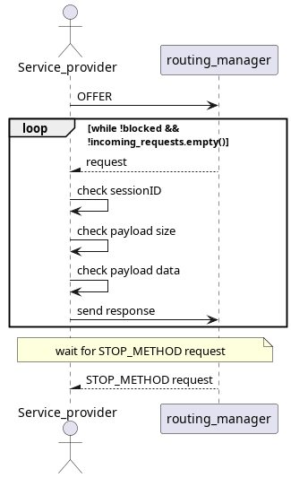
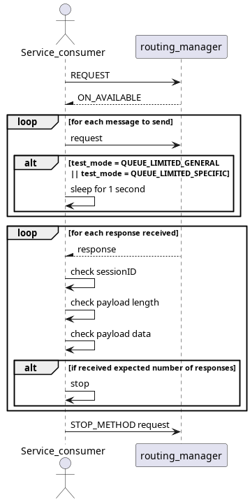

# Big Payload

This test assures that big payload messages respect the max_message_payload_size and max_queue_size in a variaty of configurations and use-cases.

## Purpose

- Assure that both local and external max payload size are respected
- Assure that both local and external max queue limits are respected
- Assure that all limits defined are respected in tcp and udp

## Test Logic

### Service provider

Service-provider, after offering the service, will, for each received request, check its session id and payload size.
It will also create a response with a payload size according to test_mode. After receiving all expected messages it will wait for STOP_METHOD request.

### Service consumer

After requesting the service and receiving its availability, it will send a set number of requests with a payload size dependent on test_mode. It will then, for each received response, check the payload and session id. When all expected responses are received, it will send a STOP_METHOD request to stop service-provider.

