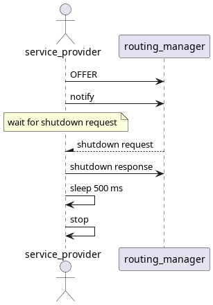
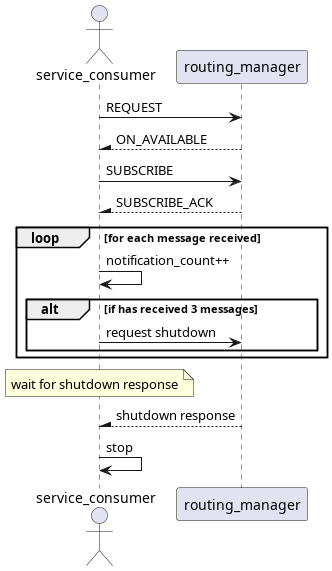

# Cyclic_event_test

## Purpose

Ensure that all expected notifications are received from service provider.

## Test Logic

There is 1 service being offered. Service provider triggers notify operation and it is expected that the service consumer receives 3 notifications.

### Service provider

Initially offers the service and triggers notify, after which it will wait for the shutdown request from service consumer and respond with a shutdown response.

### Service consumer

Initially requests and subscribes service, after which it will wait for 3 notifications to arrive, later sending the shutdown request and wait for the shutdown response.

