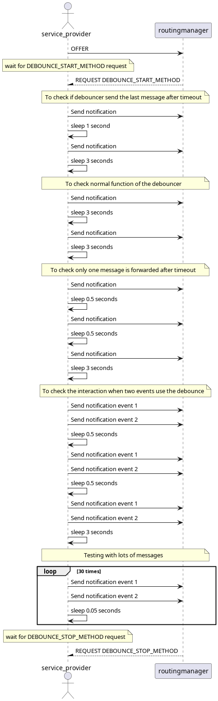
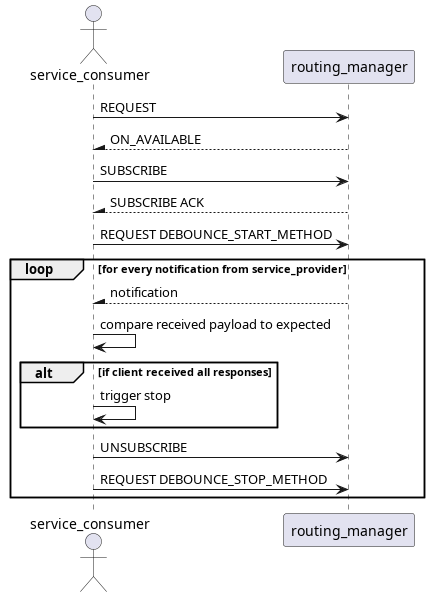

# Debounce_callback_test

This test assures that the debounce timers are respected and that the last message sent during debounce time is received after the timeout.

There is 1 service with 2 events being offered by a service-provider that are being consumed by another application, service-consumer.

## Purpose

  - Assure that debounce times are respected.
  - ASsure that last message sent during debounce time is received by the service-consumer.

## Test Logic

### Service provider

The service provider will initially offer one service with 2 different events, and wait for a request from service-consumer for the DEBOUNCE_START_METHOD to actually start sending notifications.

There are 5 scenarios covered here:
  - Send 2 notifications with a second in between to make sure that both are received.
  - Send 2 notifications with 3 seconds in between to make sure that both are received.
  - Send 3 notifications with 0.5 seconds in between to make sure that only the 1st and last are received.
  - Send 6 notifications in pairs (different events) with 0.5 seconds in between to make sure that the 1st and last pair of notifications are received.
  - Send 30 pairs of notifications (differet events) with 0.05 seconds in between to make sure that only the 1st and last pair are received.

Finally wait for another request from service-consumer for DEBOUNCE_STOP_METHOD to end operations.

### Service consumer

The service consumer will initially set the expected payloads then request and subscribe to the service offered by service-consumer, after which will send a request for DEBOUNCE_START_METHOD to start the notification sending from service-provider.

For each message received it will compare to each previously set payload to make sure that the order and number of messages are correct.

Finally send another request for DEBOUNCE_STOP_METHOD to trigger service provider stop.

