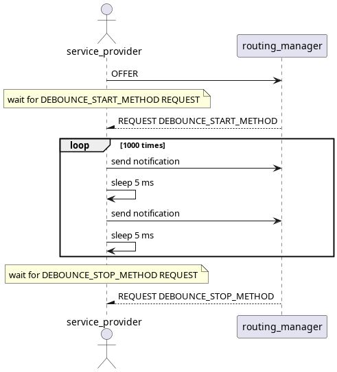
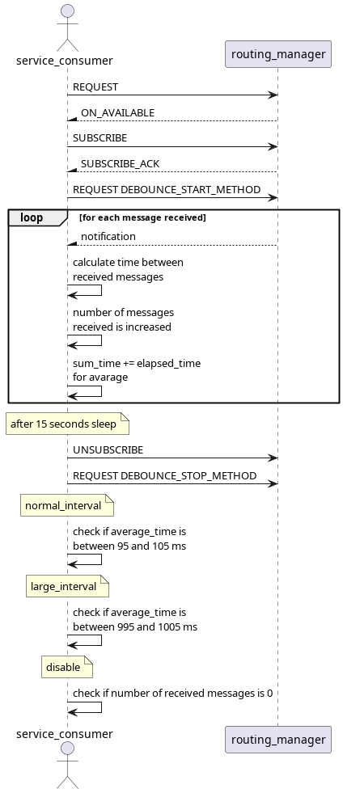

# Debounce_filter_test

This test assures that the filter passed to the application is respected and the messages respect the set debounce time.

There is 1 service being offered through all 3 tests with different debounce times.

## Purpose

- Assure that the debounce time set in the filter is respected by the application.

## Test Logic

### Service provider

Service provider intially offers the service and waits for the request for DEBOUNCE_START_METHOD from service consumer, after which sends 1001 notification pairs with 5 milliseconds in between to service consumer. Finally waits for request for DEBOUNCE_STOP_METHOD to stop operation.

### Service consumer

Service consumer requests and subscribes to the offered service, sends the request for DEBOUNCE_START_METHOD and for 15 seconds it receives notifications from service provider, checking the time between them to make sure that the debounce filter is respected. In the end it unsubscribes and sends the request for DEBOUNCE_STOP_METHOD to service provider.

#### 1st Test Case - normal_interval

Set debounce interval to 100ms.

#### 2nd Test Case - large_interval

Set debounce interval to 1 second.

#### 3rd Test Case - disable

Set debounce interval to -1 (do not receive any messages).

