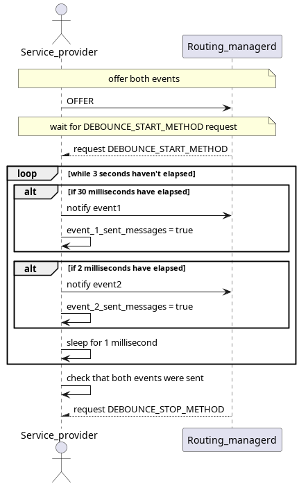
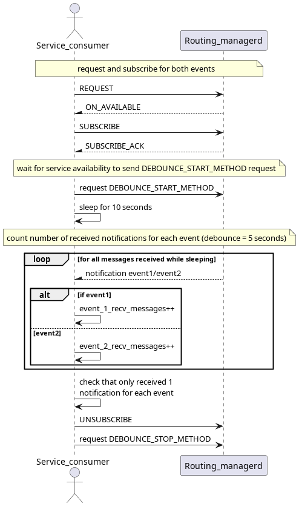

# Debounce Frequency Test

This test assures that the debounce interval times are respected. It uses one service with 2 events, both with a debounce interval of 5 seconds.

## Purpose

- Assure that debounce intervals are respected and application only received the expected number of notifications in a time frame.

## Test Logic

### Service provider

The service provider, after offering the service and receiving the DEBOUNCE_START_METHOD will start sending notifications for both of the 2 events offered for 3 seconds total. Event1 will be sent every 30 ms, and event2 every 2 ms.

### Service consumer

The service consumer, after requesting and subscribing to the offered service, will send a request for method DEBOUNCE_START_METHOD. It will then count the number of received notifications for each event in a time frame of 10 seconds. It expects to receive 1 notification for each event.

