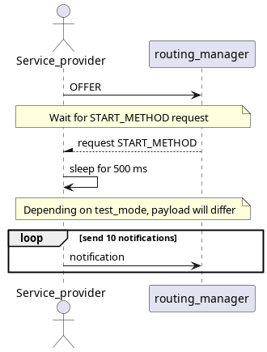

# Debounce Test

This test assures that debounce configurations are respected. It covers 3 possible configurations with the **ignore** option.

## Purpose

- Test debounce configuration with 2 ignored indexes [0,5]
- Test debounce configuration with 6 ignored indexes [0,5,7,8,9,10]
- Test debounce configuration with 2 ignored indexes with a bitmask in each index [0] -> 0x0f and [5] -> 0xfe

## Test Logic

### Service provider

Service provider, after offering the service, will wait for START_METHOD request. Then sleep for 500 milliseconds and send 10 notifications with varying payloads, according to test_mode.

### Service consumer

Service consumer, after requesting and subscribing to the 3 offered events, will send a START_METHOD request to service provider and wait for notifications. For each one will check the service and event according to test_mode and after receiving all expected notifications will send the STOP_METHOD request.

