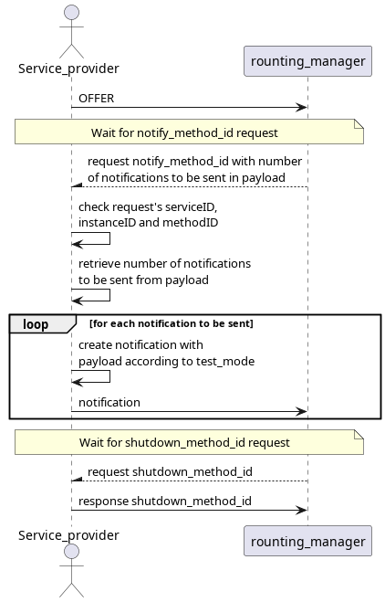
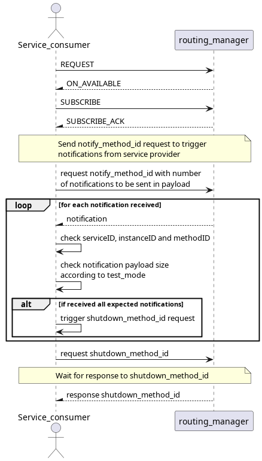

# Event Test

This test assures that event notifications are working both in udp and tcp communication.

## Purpose

- Assure that all notifications are sent and received
- Assure that both fixed and dynamic payload notifications are sent and received
- Assure that it works in udp and tcp communication

## Test Logic

### Service provider

Service provider, after offering service, waits for notify_method_id request which contains the number of notifications to be sent. For each notification it creates the payload according to test_mode. After sending all notifications it waits for shutdown_method_id request and sends a response to service consumer.

### Service consumer

Service consumer, after requesting and subscribing to service, sends a notify_method_id request containing the number of notifications that expectes to receive. For each notification it receives, it checks the sessionID, instanceID, methodID and payload according to test_mode. After all notifications are received it sends a shutdown_method_id request and waits for its response.

