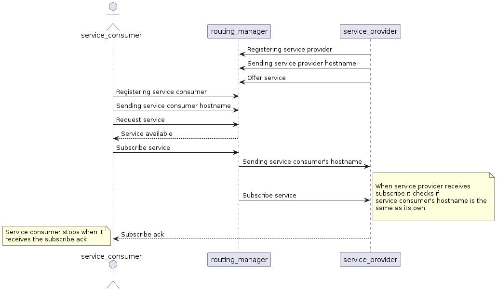

# Hostname test

This test ensures that a service consumer's hostname is correctly
sent to the a service provider offering a service that is subscribed
by the service consumer. This is checked in the subscription handler
of the service provider, from which the hostname of the service consumer
can be retrieved and checked if it was sent correctly. As both the service
consumer and service provider run on the same environment, it is possible
to verify that the hostname was correctly sent as the service consumer's
hostname has to be the same as the service provider's hostname
under this circumstances.

## Purpose

- Verify that the service consumer's hostname is correctly sent to a
service provider that offers a service that the service consumer's
is subscribing to.

## Test Logic

### Service provider

The service provider registers a subscription handler before it starts.
Upon a subscription, this subscription handler receives the service consumer's
hostname and verifies that it matches with the service provider's hostname.
After receiving the subscription the service provider stops.

### Service consumer

The service consumer waits for the service to be available and
then subscribes it.
After the service consumer receives the subscribe ack, it stops.

### Expected behavior

When each application is registered, they both send the routing manager
their hostname. After that, when the routing manager receives a subscribe,
it sends the service provider the service consumer's hostname.
If this occurs without any issues, the service provider will
receive the service consumer's hostname in its subscription handler.
