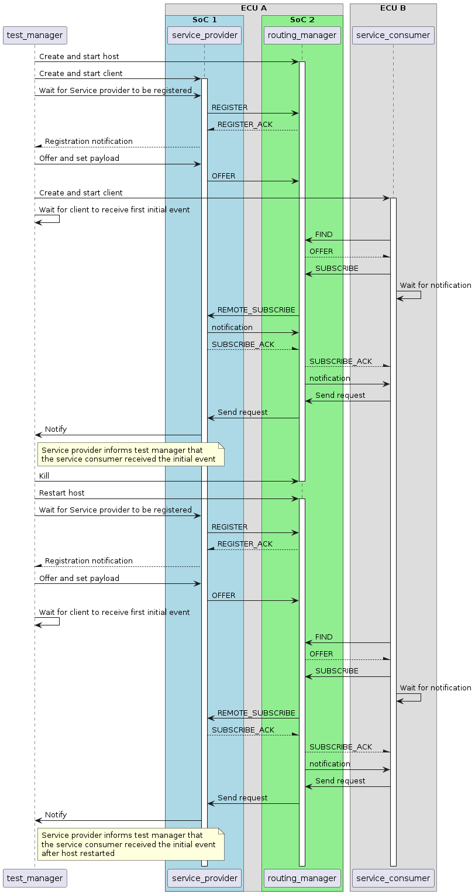

# Initial event boardnet test

In specific scenarios, ECUs can perform emergency shutdowns instead of graceful shutdown, this may lead to vsomeipd not receiving a SIGUSR1 (depending on ECU configuration), if signal is not sent, the vsomeip suspend command is not propagated to other clients.
If the ECU is composed of multiple SOCs, and there's only one routing manager on one them and if there's clients residing on other SoCs and doesn't receive the emergency shutdown, those clients will not clean up the remote subscriptions map that they manage.
Without the cleanup, a remote client subscribing after the routing manager shutdown will not receive initial events.

This purpose of this test is to ensure the fix works properly and the client cleanup the container of remote subscriptions on host reconnection.

## Purpose

- Ensure initial events are sent for remote subscriptions after routing manager restart

## Test Logic

The tests is controlled via a pseudo test manager, responsible for managing the creation of all vsip instances, with both host and service provider on the same ECU, and the consumer on another. The test manager creates the host and the service provider, a normal registration process is expected, ending with the service being offered.

Afterwards, the service consumer is created and subscribes to the remotely offered service, once the expected initial event is received, the consumer sends a message to the provider to inform of the reception of the initial event. When this message is received on provider side, it inform the test manager which sequentially kill the host and then start it again, this forces all connections to be dropped and it is expected that the providers reacts to this drop by resetting the remote subscriptions container.

On service provider and host reconnection, the service is once again offered, the consumer subscribes once again, receives the initial event and sends the request to the provider to inform of the initial event reception. If the initial event isn't handled, both consumer and provider timeout on waiting respectively on the initial event and on the request and force the test failure.

