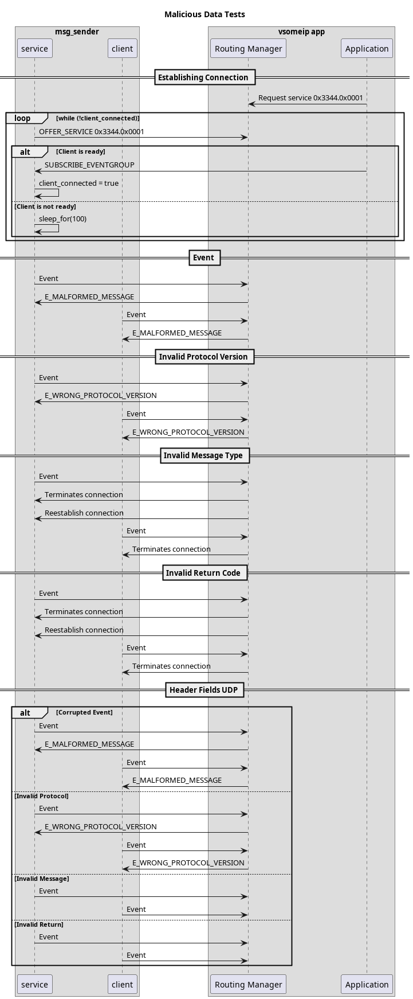

# Malicious Data Tests

## Overview

The `malicious_data_tests` verify how vSomeIP behaves when receiving malformed/corrupted messages.
These tests ensure that the implementation correctly:

- Validates message headers and payloads;
- Rejects invalid data;
- Maintains communication stability under fault conditions.

Each test targets a specific header field or message type.
By sending malformed messages over TCP and UDP, the tests confirm that vSomeIP responds either by:

- Rejecting the message;
- Returning an error;
- Closing the connection;

Without affecting the stability or availability of other valid communication channels.

### Test Execution

Each test variant runs with malformed messages sent via:

1. **TCP as server**: Master sends malicious data to slave acting as client
2. **TCP as client**: Master sends malicious data to slave acting as service
3. **UDP (where applicable)**: Direct UDP message sending for header field validation

 Execution Diagram

### Test Variants

There are 5 test variants:

#### Events

Tests handling of malformed event messages sent over TCP connections.

**Expected Behavior**:

- Both client and server must properly process the malformed event stream

### Protocol Version

Validates handling of messages with invalid protocol version fields.

**Expected Behavior**:

- Invalid protocol version messages are rejected with E_WRONG_PROTOCOL_VERSION

### Message Type

Tests handling of messages with invalid message type fields.

**Expected Behavior**:

- Invalid message type messages cause connection termination

### Return Code

Tests handling of messages with invalid return code fields.

**Expected Behavior**:

- Invalid return code messages cause connection termination

#### Header Fields UDP

Tests the same invalid header fields as the above mentioned tests, but sent over UDP instead of TCP.

**Expected Behavior**:

- Invalid protocol version messages are rejected with E_WRONG_PROTOCOL_VERSION
- Invalid message type and return code messages are handled appropriately
- UDP communication remains functional for valid messages
