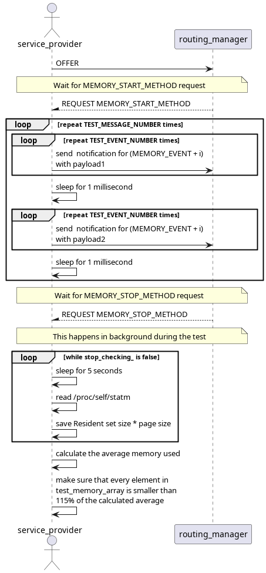
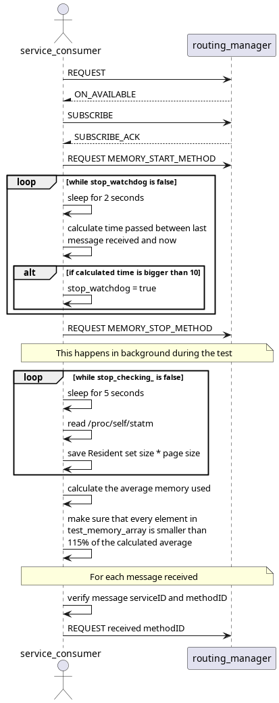

# Memory Test

This test makes sure that memory load does not increase significantly during vsomeip-lib operation. It has one service-provider offering a service and sending notifications for various methods with different payloads and a service-consumer subscribing to the offered service sending requests for every notification received.

## Purpose

- Assure that memory load usages does not increase significantly

## Test Logic

### Service provider

The service provider after offering the service, waits for MEMORY_START_METHOD request and starts the memory check process that retrieves resident set size and page size and multiply them together during the whole test execution time. After receiving the MEMORY_START_METHOD it starts sending 2 notifications with 2 different payloads for all methodIDs. When all notifications are sent the service provider waits for MEMORY_STOP_METHOD request and verifies that each memory load calculated during the test process is smaller than 115% of its average.

### Service consumer

The service consumer after requesting and subscribing to the offered service sends a MEMORY_START_METHOD request. Like the service provider it also starts the memory check process that is maintained during the whole test duration. For each message that it receives, it calculates the time between last message and current message and if elapsed time is bigger than 10 seconds it concludes the test and sends a MEMORY_STOP_METHOD request. It makes the same memory load calculations as service provider making sure memory load was under expected values.

