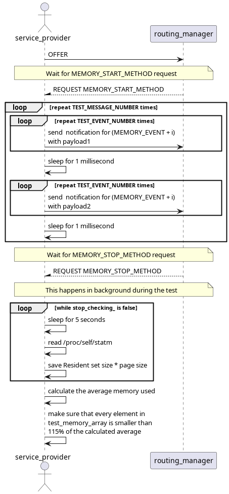
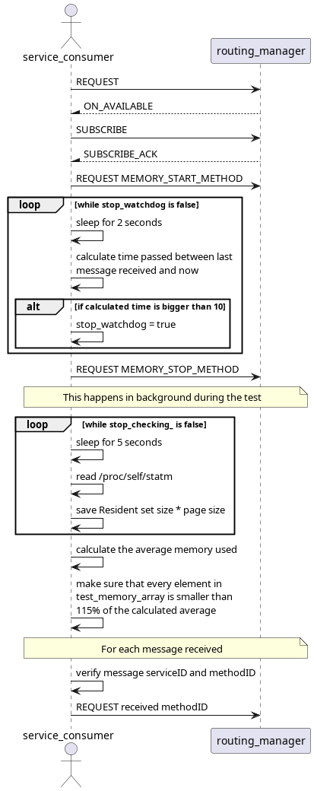

# Memory Test

This test makes sure that memory load does not increase significantly during vsomeip-lib operation. It has one service-provider offering a service and sending notifications for various methods with different payloads and a service-consumer subscribing to the offered service sending requests for every notification received.

## Purpose

- Assure that memory load usages does not increase significantly

## Test Logic

### Service provider

The service provider after offering the service, waits for MEMORY_START_METHOD request and starts the memory check process that retrieves resident set size and page size and multiply them together during the whole test execution time. After receiving the MEMORY_START_METHOD it starts sending 2 notifications with 2 different payloads for all methodIDs. When all notifications are sent the service provider waits for MEMORY_STOP_METHOD request and verifies that each memory load calculated during the test process is smaller than 115% of its average.



### Service consumer

The service consumer after requesting and subscribing to the offered service sends a MEMORY_START_METHOD request. Like the service provider it also starts the memory check process that is maintained during the whole test duration. For each message that it receives, it calculates the time between last message and current message and if elapsed time is bigger than 10 seconds it concludes the test and sends a MEMORY_STOP_METHOD request. It makes the same memory load calculations as service provider making sure memory load was under expected values.



## Flamegraph Profiling (CPU Performance Analysis)

### Overview

This test supports optional CPU flamegraph profiling via Linux `perf`. Flamegraphs visualize where the CPU time is spent during test execution, making it easy to identify performance hotspots and bottlenecks.

### Enabling Flamegraph Profiling

Flamegraph profiling is **automatically enabled** when `VALGRIND_TYPE` is empty. It is **disabled** when any valgrind profiler is active (memcheck, massif, etc.).

#### Via CMake (build-time configuration)

```bash
# Build without valgrind/sanitizers (perf profiling will be enabled automatically)
cmake -DCMAKE_BUILD_TYPE=RelWithDebInfo ...
ctest --preset ci-network-tests
```

#### Via Docker Compose (runtime configuration)

```bash
# Leave VALGRIND_TYPE and SANITIZER_TYPE empty to enable perf profiling
export VALGRIND_TYPE=''
docker compose --project-directory zuul/network-tests up
```

### What Happens When VALGRIND_TYPE is Empty

1. **Service and client processes** are launched under `perf record` at 99 Hz sampling frequency with call-graph recording (`-g`)
2. **Valgrind is automatically skipped** (perf and valgrind cannot run together)
3. **After tests finish**, flamegraph SVG files are automatically generated from the recorded perf data
4. **Output files** are placed in the test binary directory:
   - `memory_test_service_flamegraph.svg` — interactive flamegraph for the service
   - `memory_test_client_flamegraph.svg` — interactive flamegraph for the client
   - `memory_test_service_firefox_profiler.perf` — Firefox Profiler compatible file
   - `memory_test_client_firefox_profiler.perf` — Firefox Profiler compatible file
