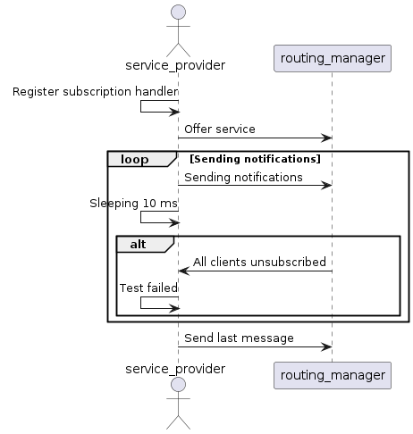
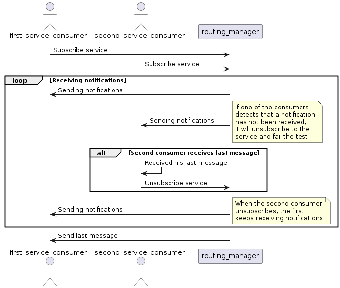

# Multicast group test

This test ensures that when there are two remote subscribers
from the same device to a service that notifies via multicast
and one of the subscribers unsubscribes to the service, the device
as a whole does not leave the multicast group and the client that
is still subscribed to the service does not miss any notification sent.

In the first device, the service is being offered by the service application
and there is a routing manager present. In the second device, there is a
routing manager and two clients subscribed to the service being offered
in the first device. However, one of the clients unsubscribes to the service
while the other is still subscribed, to check if the one still subscribed
receives all the notifications being sent.

## Purpose

- Ensure that when one of the clients unsubscribes to a remote service
subscribed by other client in the same device, the other client still
gets all notifications.

- When the first client unsubscribes, the routing manager of the device
does not leave the multicast group to where the service sends
the notifications.

## Test Logic

### Service provider

The service application starts by offering the test service. After this,
the test service/event is being notified in a loop, sending a notification
each ~10ms. This happens until either all notifications are sent, and after
that the final message is sent to signal the client that the service sent
all notifications, or when no clients are subscribed to it (after at least
one has subscribed), which signals that a client has not received all
notifications and as such there has been an error, ending the test
earlier with a failure.

### Service consumer

There are two service consumers that are in a different device from where
the service is being provided. The service consumers check if the payload
that they received is the expected, that is, if it corresponds to the value
of the last payload increased by one. This happens until either the last msg
is received, which indicates that everything went well with the test, leading
to the client unsubscribing to the service, or if there was a problem when
receiving the notifications, such as receiving a payload with a value higher
than expecting, still leading to unsubscribing to the service but with
a test failure.

The second service consumer expects its last message with value lesser than
the first consumer. This will lead to a situation where the first consumer is
still subscribed to the service but the second will unsubscribe to it. This is
done to check the behavior of the routing manager when one of the clients
unsubscribes to the service but the other one is still subscribed, with the
expected behavior being that the routing manager does not leave the multicast
group where the service is being notified.
