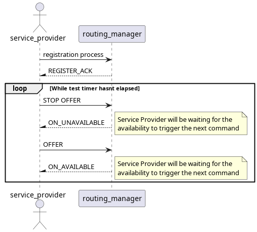
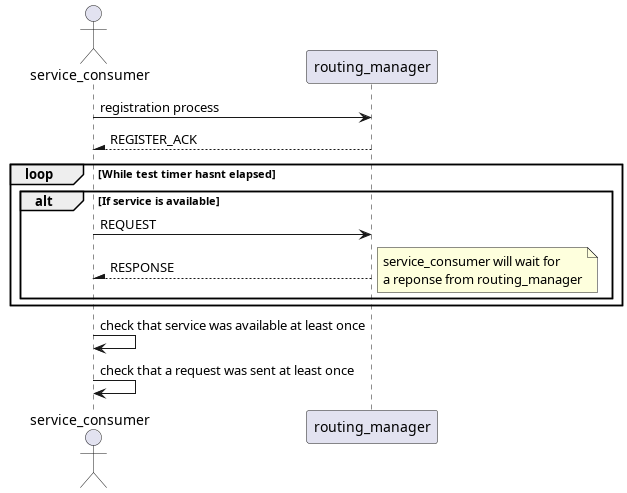

# Offer Stop Offer Test

This test assures that, in the case of a offer command followed by a stop offer, the service availability is not put in an invalid state.

There are 2 services, one that uses tcp only and one where tcp + udp are used. The same reliable endpoint is used for both services.

Whenever one is offered, so is the other and the same is true for stop offers.

## Purpose

- Assure that services are kept in a valid available/unavailable state.
- Assure that all availability reports are sent for each offer/stop offer processed.

## Test Logic

### Service provider
In a given time frame, the service-provider will, after initially offering the services, send a stop offer command followed by offer command and repeat this until the timer reaches the end.

### Service consumer
In a given time frame, the service-consumer will request the services and wait for their availability. After it, it only checks if it indeed requested and received the availability for the services.

