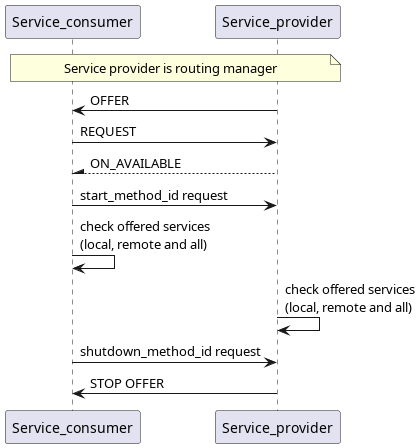

# Offered Services Info Test

This test assures that, given an offer_type, all offered services that match it are retrievable by ```get_offered_services_async``` either by the offering application or the requesting one.

## Purpose

- Assure that only locally offered services are retrieved
- Assure that only remotely offered services are retrieved
- Assure that all offered services are retrieved

## Test Logic

### Service provider
The service provider offers 5 services/instances, 2 locally and 3 remotely. It waits for the start_method_id request from service consumer, after that, it checks the locally offered services, then the remotely offered services and finally all offered services. After checking everything, it waits for a shutdown_method_id request from service consumer to stop.

### Service consumer
The service consumer requests 5 services/instances after which waits for their availability. When everything is available, it sends a start_method_id after which it gets the locally offered services, then the remotely offered services and finally all offered services. It checks all number of services retrieved comparing them to the expected number. After everything it sends a shutdown_method_id request to service provider to trigger shutdown and stops.


