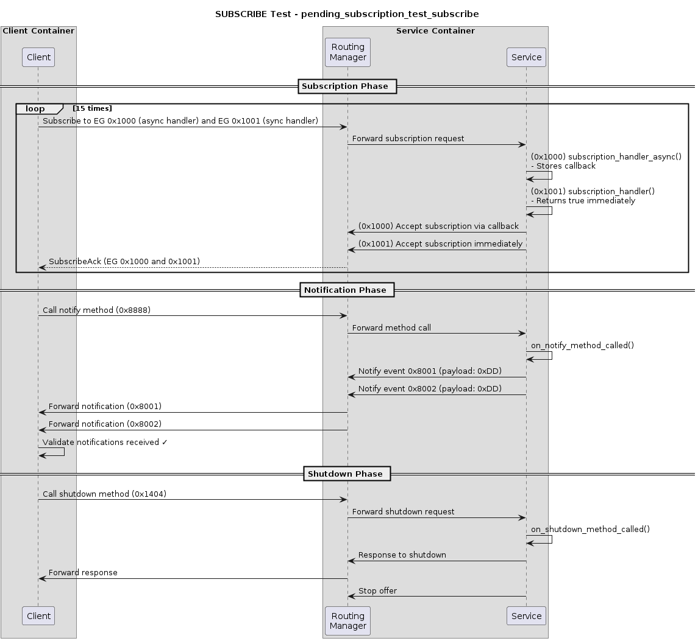
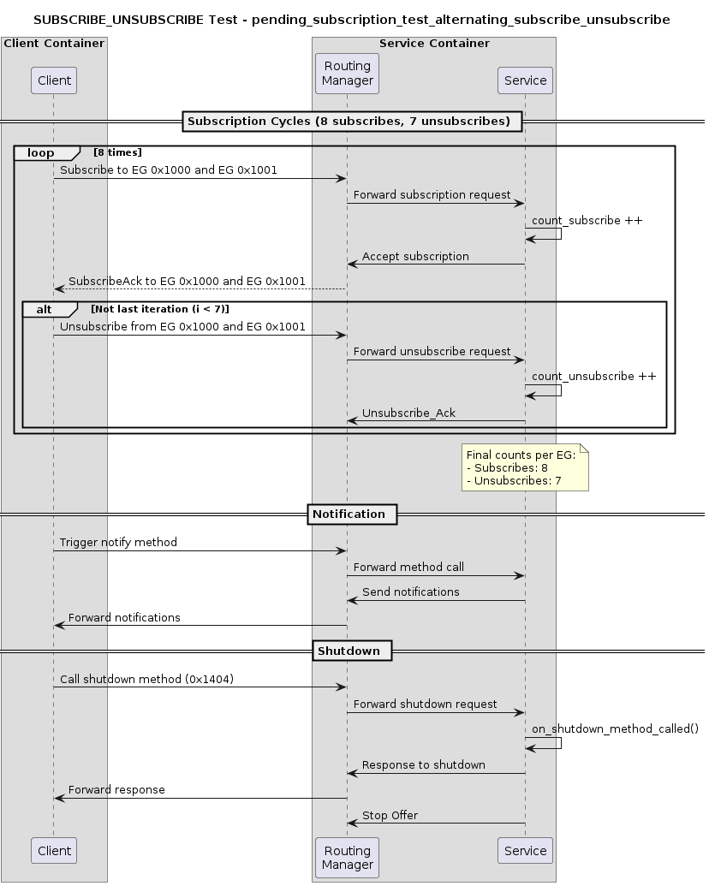
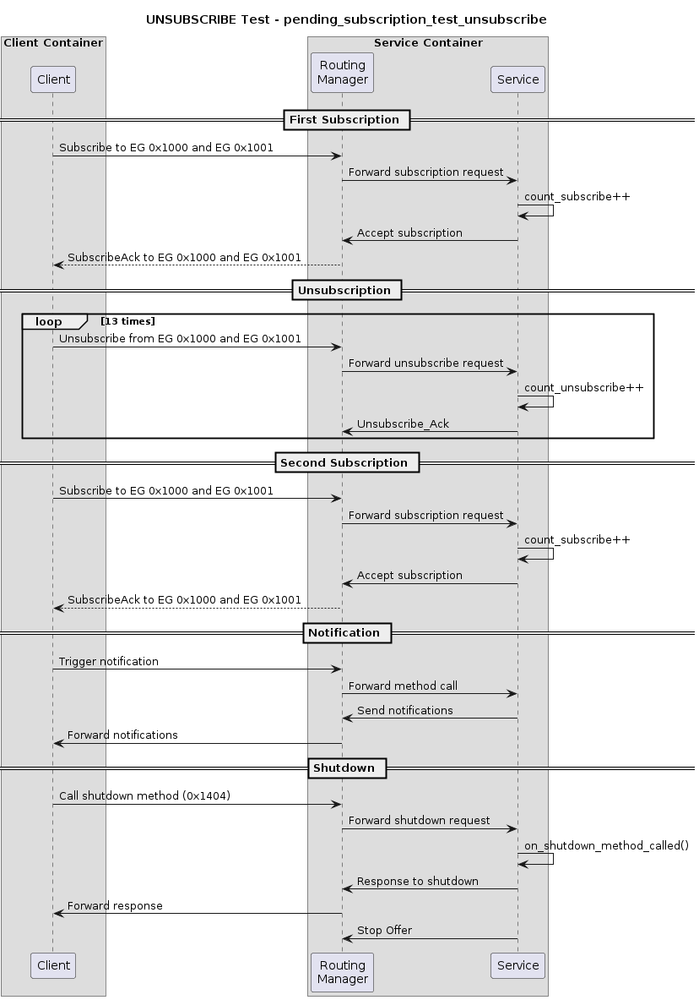
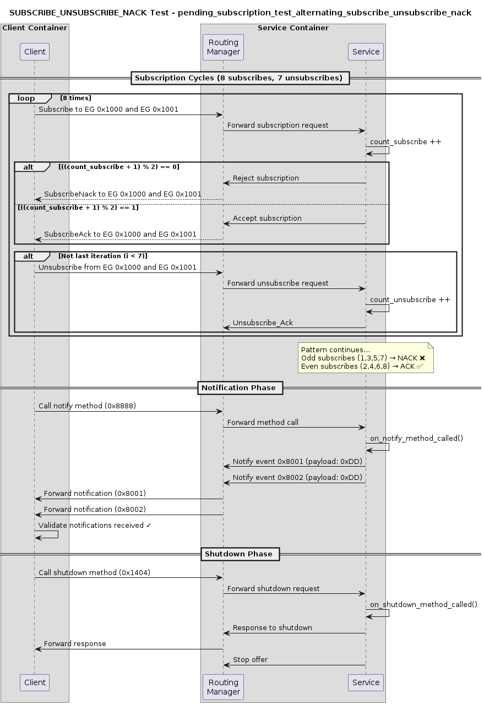
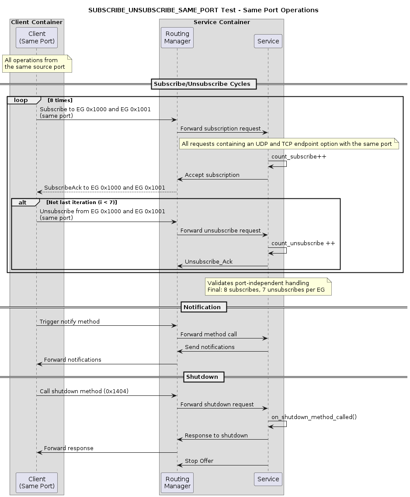
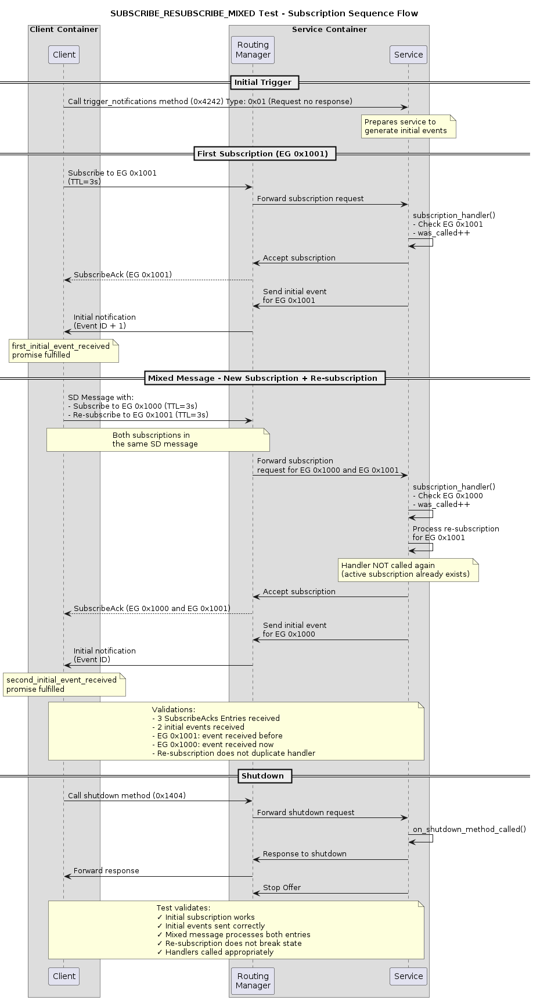
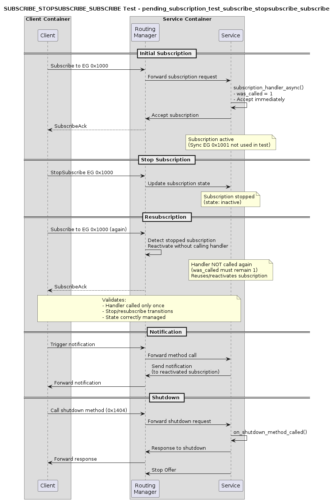
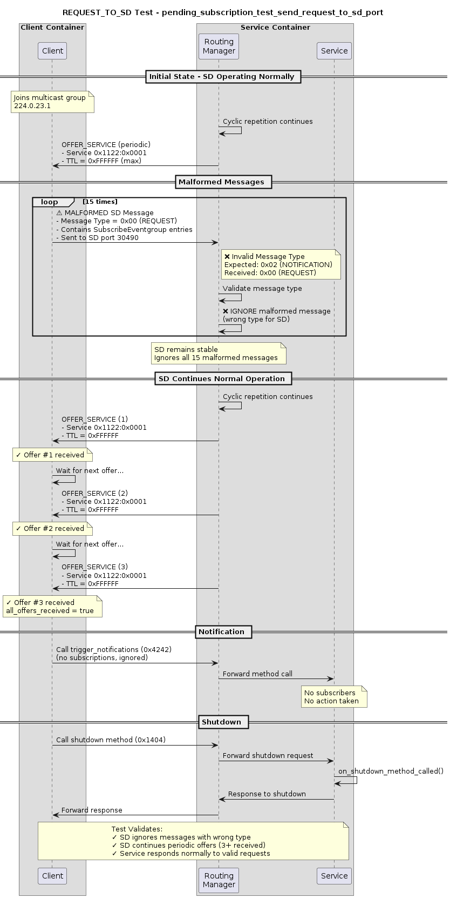

# Pending Subscription Tests

## Overview

The pending subscription tests validate the behavior of vsomeip when handling subscription requests under various scenarios. These tests ensure that the service discovery mechanism correctly processes subscriptions, unsubscriptions, and edge cases like rapid subscribe/unsubscribe sequences.

## Test Architecture

Each test consists of two components:
- **Service**: `pending_subscription_test_service` - Acts as the service provider
- **Client**: `pending_subscription_test_sd_msg_sender` - Acts as the service consumer

The service offers two eventgroups with different subscription handler types:
- Eventgroup 0x1000: Asynchronous subscription handler
- Eventgroup 0x1001: Synchronous subscription handler

**Note**: The routing manager runs in the service container and handles all message routing between client and service.

## Test Modes

### 1. SUBSCRIBE

**Purpose**: Validates basic subscription acceptance flow.

**Service Behavior**:

- Accepts subscriptions to both eventgroups
- Asynchronous handler stores callback and waits for manual trigger
- Synchronous handler accepts immediately

**Client Behavior**:

- Subscribes to both eventgroups
- Waits for SubscribeAck
- Triggers notification
- Validates notification reception
- Validates shutdown response reception

**Expected Result**: Both subscriptions accepted, notifications received successfully.

<details><summary>Diagram</summary>

<p align="left">
    
</p>
</details>

---

### 2. SUBSCRIBE_UNSUBSCRIBE

**Purpose**: Tests handling of multiple rapid subscribe/unsubscribe cycles.

**Service Behavior**:

- Accepts all subsequent subscriptions/unsubscriptions
- Expects 8 subscriptions and 7 unsubscriptions per eventgroup

**Client Behavior**:

- Performs 8 subscribe operations
- Performs 7 unsubscribe operations
- Validates proper acknowledgment of each operation
- Validates notification reception
- Validates shutdown response reception

**Expected Result**: All subscribe/unsubscribe operations processed correctly.

<details><summary>Diagram</summary>

<p align="left">
    
</p>
</details>

---

### 3. UNSUBSCRIBE

**Purpose**: Validates proper handling of unsubscription requests.

**Service Behavior**:

- Accepts subscriptions and unsubscriptions
- Expects 2 subscriptions and 13 unsubscription per eventgroup

**Client Behavior**:

- Subscribes twice to both eventgroups
- Unsubscribes thirteen times between the two subscriptions
- Validates acknowledgments
- Validates notification reception
- Validates shutdown response reception

**Expected Result**: Subscriptions and unsubscriptions processed correctly.

<details><summary>Diagram</summary>

<p align="left">
    
</p>
</details>

---

### 4. SUBSCRIBE_UNSUBSCRIBE_NACK

**Purpose**: Tests subscription rejection (NACK) behavior.

**Service Behavior**:

- Rejects every firts subscription (alternating NACK/ACK)
- Accepts all unsubscriptions
- Expects 8 subscriptions and 7 unsubscriptions per eventgroup

**Client Behavior**:

- Attempts 8 subscriptions
- Expects 4 subscriptions rejected and 4 accepted
- Performs 7 unsubscriptions
- Validates NACK handling
- Validates notification reception
- Validates shutdown response reception

**Expected Result**: Rejected subscriptions properly handled, accepted ones work correctly.

<details><summary>Diagram</summary>

<p align="left">
    
</p>
</details>

---

### 5. SUBSCRIBE_UNSUBSCRIBE_SAME_PORT

**Purpose**: Tests subscription handling when multiple clients use the same port.

**Service Behavior**:

- Accepts all subscriptions/unsubscriptions (All requests containing an UDP and TCP endpoint option with the same port)
- Expects 8 subscriptions and 7 unsubscriptions per eventgroup

**Client Behavior**:

- Multiple subscribe/unsubscribe operations from same port
- Validates proper routing and acknowledgment
- Validates notification reception
- Validates shutdown response reception

**Expected Result**: All operations processed correctly despite same port usage.

<details><summary>Diagram</summary>

<p align="left">
    
</p>
</details>

---

### 6. SUBSCRIBE_RESUBSCRIBE_MIXED

**Purpose**: Tests resubscription scenarios with mixed subscription states.

**Service Behavior**:

- Accepts single subscription per eventgroup
- Both handlers accept immediately

**Client Behavior**:

- Subscribes to eventgroup 0x1001
- Performs resubscription operation for eventgroup 0x1001 and subscription operation for eventgroup 0x1000
- Validates state consistency
- Validates notification reception
- Validates shutdown response reception

**Expected Result**: Resubscriptions handled without duplication or errors.

<details><summary>Diagram</summary>

<p align="left">
    
</p>
</details>

---

### 7. SUBSCRIBE_STOPSUBSCRIBE_SUBSCRIBE

**Purpose**: Tests subscription after a stop-subscribe operation.

**Service Behavior**:

- Accepts single subscription
- Only async handler is tested (sync auto-accepted)

**Client Behavior**:

- Subscribes to eventgroup
- Stops subscription and subscription (only one message)
- Validates proper state transitions
- Validates notification reception
- Validates shutdown response reception

**Expected Result**: Stop-subscribe and resubscribe operations work correctly.

<details><summary>Diagram</summary>

<p align="left">
    
</p>
</details>

---

### 8. REQUEST_TO_SD

**Purpose**: Tests service discovery request handling without valid subscriptions.

**Service Behavior**:

- Marks both handlers as accepted immediately (no real subscriptions expected)
- Validates SD request processing

**Client Behavior**:

- Sends service discovery requests
- Does not send actual subscription messages
- Validates SD response handling
- Validates shutdown response reception

**Expected Result**: SD requests processed without subscription validation.

<details><summary>Diagram</summary>

<p align="left">
    
</p>
</details>

---

## Key Components

### Subscription Handlers

1. **Asynchronous Handler** (Eventgroup 0x1000):
   - Provides callback function for deferred acceptance
   - Allows testing of delayed subscription processing

2. **Synchronous Handler** (Eventgroup 0x1001):
   - Returns immediate acceptance/rejection
   - Tests direct subscription validation

### Timing Considerations

- Simulates real-world processing time
- Tests pending subscription queue behavior

### Notification Mechanism

- Service notifies on method call trigger
- Validates end-to-end subscription functionality

## Running Tests

```bash
# Service side
./pending_subscription_test_service <TEST_MODE>

# Client side
./pending_subscription_test_sd_msg_sender <TEST_MODE>
```

Available test modes:
```bash
- SUBSCRIBE
- SUBSCRIBE_UNSUBSCRIBE
- UNSUBSCRIBE
- SUBSCRIBE_UNSUBSCRIBE_NACK
- SUBSCRIBE_UNSUBSCRIBE_SAME_PORT
- SUBSCRIBE_RESUBSCRIBE_MIXED
- SUBSCRIBE_STOPSUBSCRIBE_SUBSCRIBE
- REQUEST_TO_SD
```

## Success Criteria

All tests should:

1. Complete without assertion failures
2. Properly synchronize between client and service
3. Handle all subscription state transitions correctly
4. Clean up resources on exit
