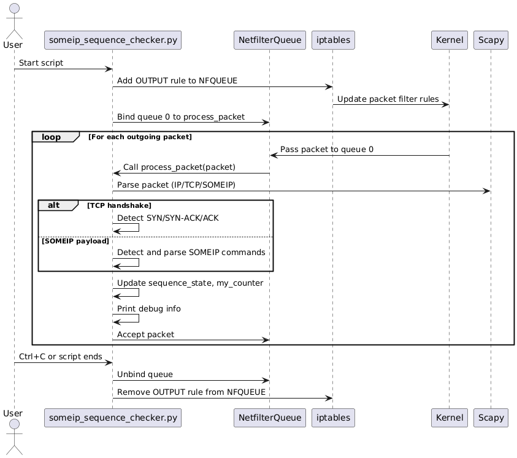
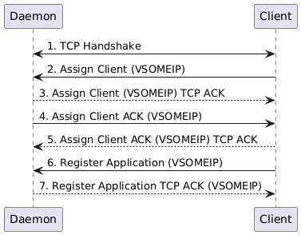

# Registration Check Test

This test verifies that the `service` application can be initialized and successfully registers within a specified timeout period.
In this test, a service application (registration_check_service.cpp) attempts to register with the routing manager.

During this process, a Python script (someip_sequence_checker.py) is activated to intercept outgoing TCP packets 
using NetfilterQueue and Scapy, monitoring for a specific sequence of SOMEIP protocol messages during the registration phase.

If a delay occurs at message #7, the client initiates a new TCP session reusing the same ports and restarts the sequence from message #1.

## Purpose

To ensure that the service application:
- Initializes correctly.
- Starts and attempts to register.
- Becomes registered within 30 seconds (configurable).
- Cleans up properly after the test.

## Test Logic

1. **Initialize the service:**  
   The test creates a `service` instance and calls `init()`. If initialization fails, the test aborts.

2. **Start the service:**  
   The service is started, which should trigger the registration process.

3. **Wait for registration:**  
   The test waits up to 30 seconds, polling every 100 milliseconds to check if the service is registered.

4. **Assert registration:**  
   If the service is not registered within the timeout, the test fails.

5. **Cleanup:**  
   The service is stopped at the end of the test.

## Notes

- If the service registers immediately, the test will complete early.
- If the service fails to register, the test will fail after the timeout period.
