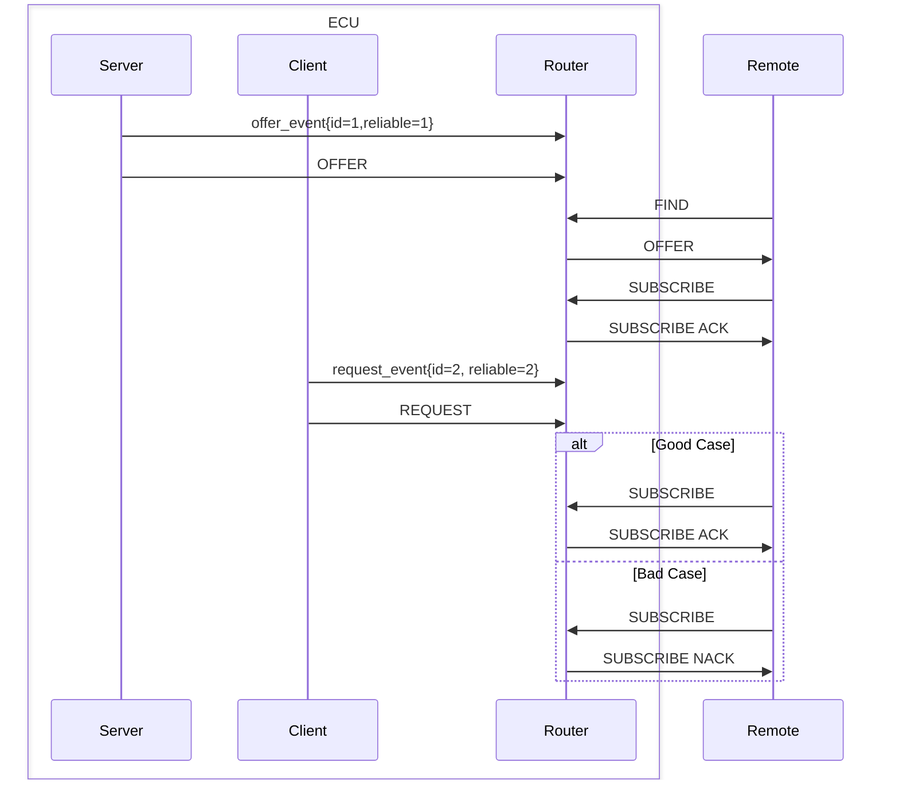

# Invalid Event Test

## Purpose

This test checks if the server continues to acknowledge valid subscriptions after a client tries to
register an invalid event with the wrong reliability type.

## Flow

The test flows like this:

- The Server offers the test service and registers one event as reliable.
- The Remote successfully subscribes to that event.
- The Client registers a different event with the wrong reliability.
- The Remote **should** still be able to subscribe to the original event.
