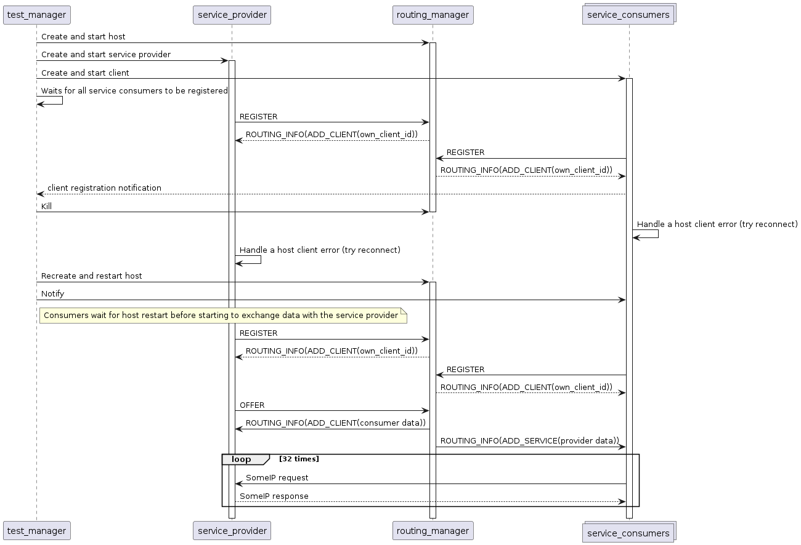
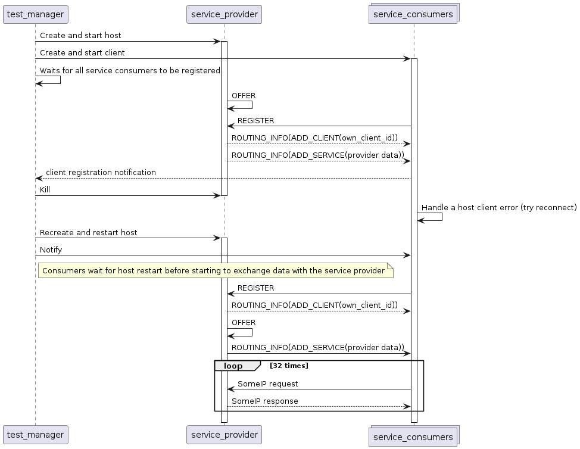

# Restart routing test

Guarantee clients behavior upon routing manager restart, processes are orchestrated via a test manager that sets up a share memory segment to synchronize with clients.

## Purpose

- Ensure that clients are able to reregister and exchange SomeIP message when the routing manager is restarted in middle life cycle.

## Test Logic

### Restart routingmanagerd using tcp as local communication medium
Using a configuration that enables tcp for local communication, the test manager starts service consumers(number of service consumers for each test is defined via NUM_SERVICE_CONSUMERS macro), provider and the host. Both provider and consumers are expected to register to the host and when all consumers are registered (notify manager via shared memory), the test manager restarts the host (routingmanagerd).
Upon host restart, all clients should handle endpoint closing and start reconnect sequence. The test manager, using the allocated shared memory, notifies service consumers that restart has occurred and that they start exchanging SomeIP messages with service provider until the test defined maximum pair of request/response (32).

### Restart service provider acting as routing manager
Also using tcp for local communication, nevertheless, the service provider acts as routingmanager and gets restart in mid life cycle.

### Restart routingmanagerd using uds as local communication medium
Similar to the first test, nevertheless unix domain sockets are used as local communication medium.
