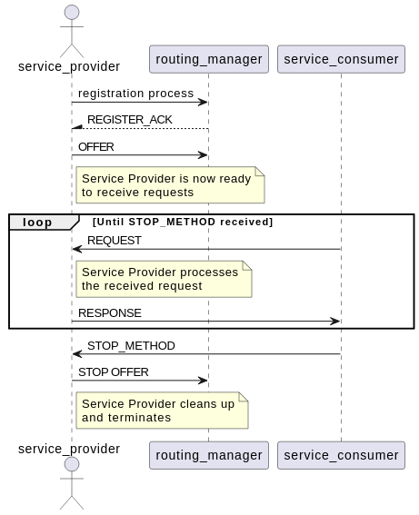
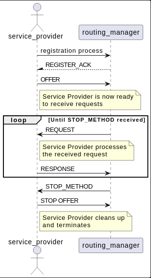
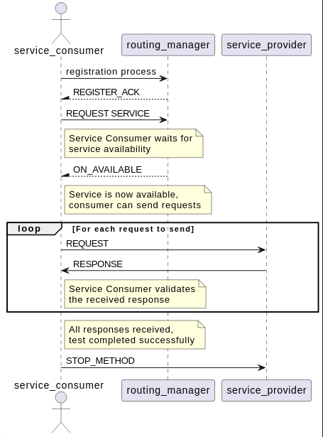
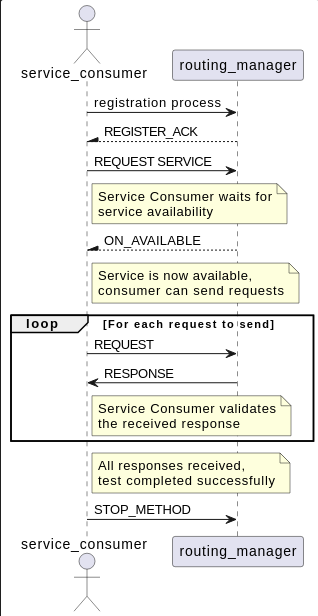

# Routing Tests

This test validates the routing manager functionality in vsomeip, ensuring proper service discovery, message routing between applications, and handling of routing-related operations in different configurations.

## Purpose

- Verify that the routing manager correctly manages service registrations and availability notifications
- Ensure proper message routing between service providers and consumers through the routing manager
- Validate routing manager's handling of multiple clients and services
- Test routing manager failover and state management
- Ensure correct behavior in both local and external routing scenarios

## Test Logic

### Service provider

Service-provider, after registering with the routing manager and offering the service, will wait for incoming requests. For each received request, it will process the message and send back a response through the routing manager. After receiving all expected messages, it will wait for a STOP_METHOD request to terminate.

### Local Routing

### External Routing

### Service consumer

After requesting the service and receiving its availability notification from the routing manager, the client will send a set number of requests to the service. It will then validate each received response to ensure correct routing and message delivery. When all expected responses are received, it will send a STOP_METHOD request to stop the service-provider.

### Local Routing

### External Routing

## Test Scenarios

### Local Routing

Tests routing functionality when all applications run on the same device, using local (Unix domain socket) communication.

### External Routing

Tests routing functionality when applications communicate over network interfaces, validating TCP/UDP routing capabilities.

## Expected Results

- All applications successfully register with the routing manager
- Service availability notifications are correctly delivered to consumers
- Messages are properly routed between providers and consumers
- No messages are lost or misrouted
- Proper cleanup and deregistration occurs when applications terminate
