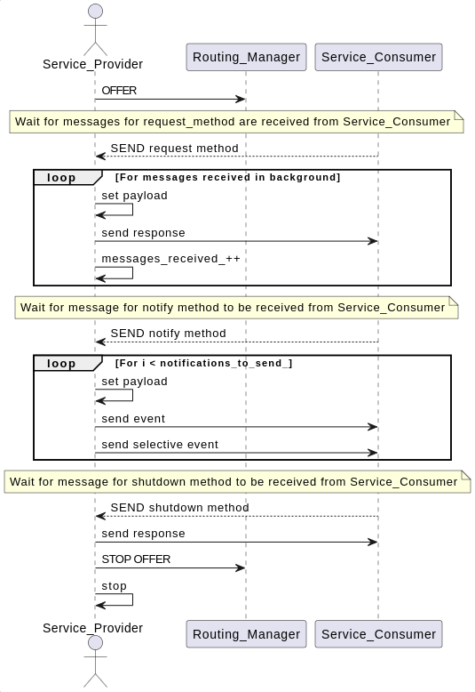
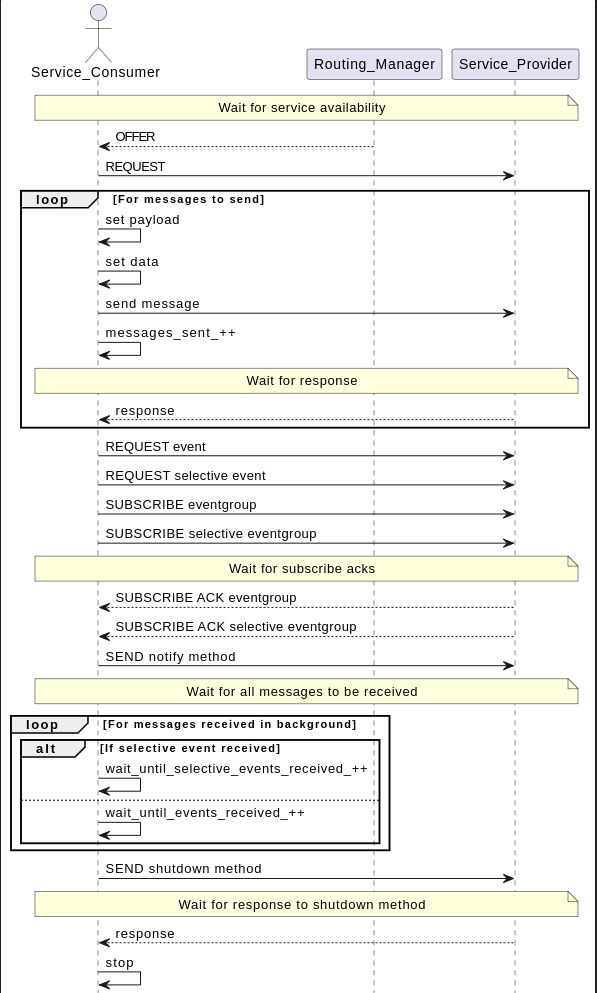

# Second Address Tests

This test validates that vsomeip applications can communicate correctly regardless of the IP address. The test verifies that services can be discovered and accessed across different IP addresses, ensuring proper routing and endpoint management.

## Purpose

Depending on network configuration:

- Assure that services can be offered and discovered across multiple IP addresses
- Validate proper routing manager behavior with multiple network addresses
- Test event subscription and notification across different IP addresses

## Test Logic

### Service provider

Service provider, after registering and becoming available, starts offering the service on its configured IP address. It handles incoming requests, processes subscription requests for both regular and selective events, and responds to notification requests. The service waits for a specific number of messages to be received, then processes notification requests and sends events to subscribed clients. Finally, it waits for a shutdown method call before terminating.

### Service consumer

Service consumer, running on a different IP address, registers with the routing manager and discovers the service offered by the master. It subscribes to both regular and selective events, sends a series of request messages, waits for responses, then requests event notifications. After receiving all expected events, it sends a shutdown request to the service and terminates.

