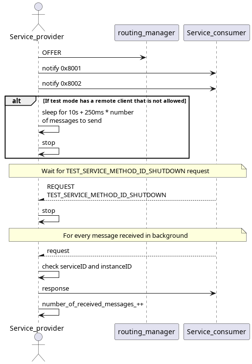
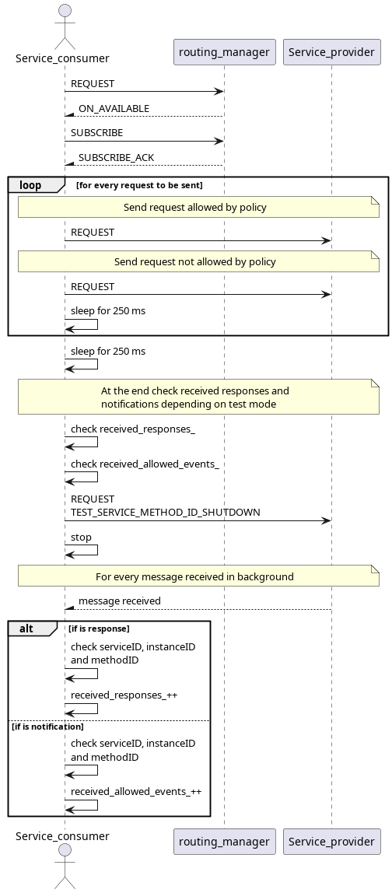

# Security Test

This test assures that the security polices set on the config file are being respected. The test can run for an allowed or not allowed remote client and local client.
The service provider offers one service with 2 events (0x8001 and 0x8002) both on unreliable endpoints one of which (0x8002) is not allowed byt the client.

## Purpose

Depending on security policies configuration:
- Assure that remote_clients are allowed
- Assure that remote_clients are not allowed
- Assure that only allowed methodIDs notifications are received

## Test Logic

### Service provider

Service provider, after registering, starts offering the service and notifying both 0x8001 and 0x8002 methods. If the client is external and not allowed, it will wait 10 seconds + 250ms for every message to be sent and then stop. Otherwise it will wait for the TEST_SERVICE_METHOD_ID_SHUTDOWN request to be received. For every request it receives, it checks the serviceID and instanceID and sends a response back.

### Service consumer

Service consumer after registering, requests and subscribes to the offered service. It then starts sending 2 requests, one for an allowed methodID and another for a not allowed methodID. For every message received it checks the serviceID, instanceID and methodID and depending on if its a response or a notification, it increments one on received_responses_ or received_allowed_events_ respectively. After sending all requests it checks the received responses and notifications, sends the TEST_SERVICE_METHOD_ID_SHUTDOWN request and stops.

