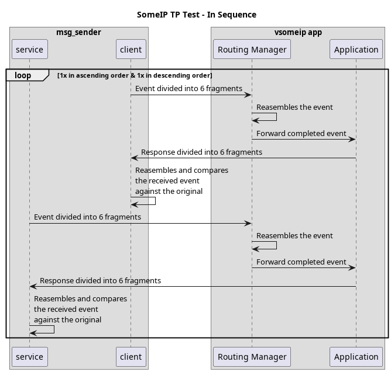
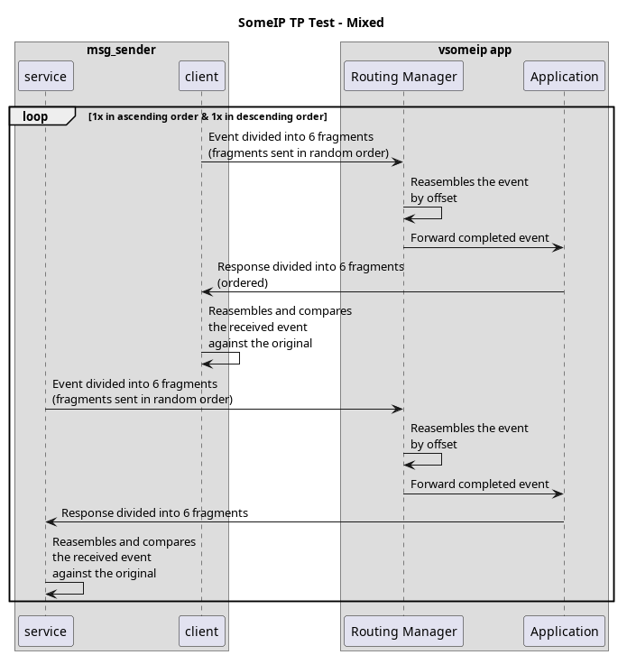
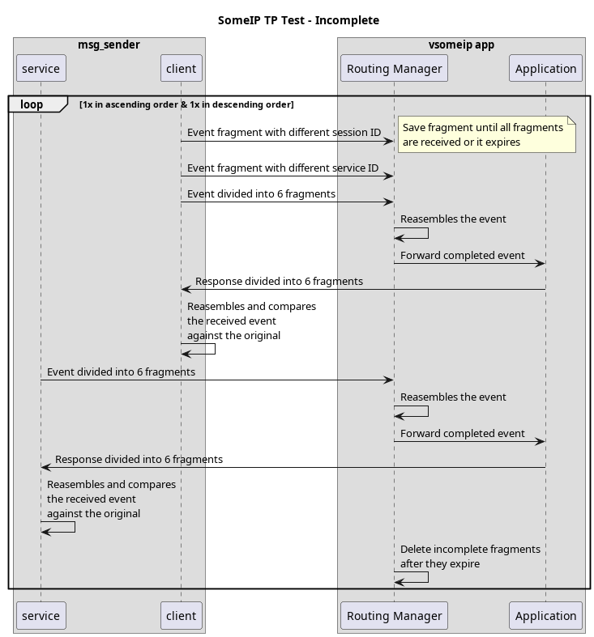
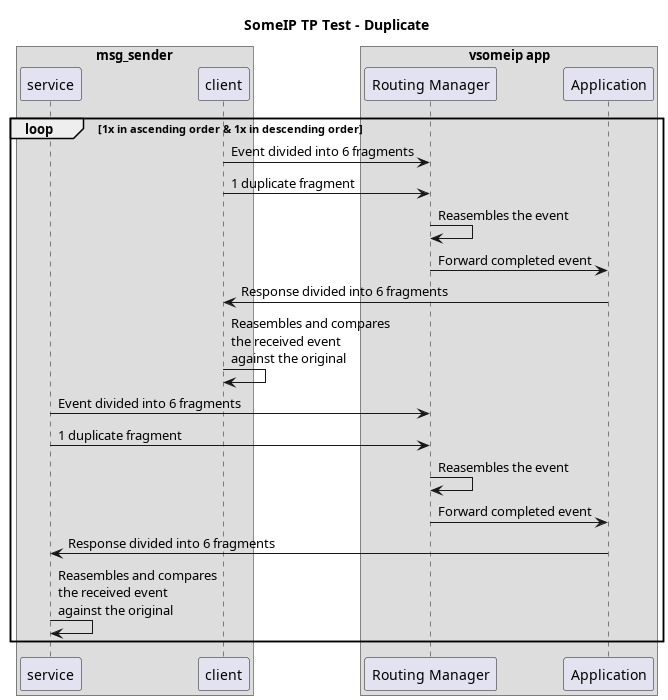
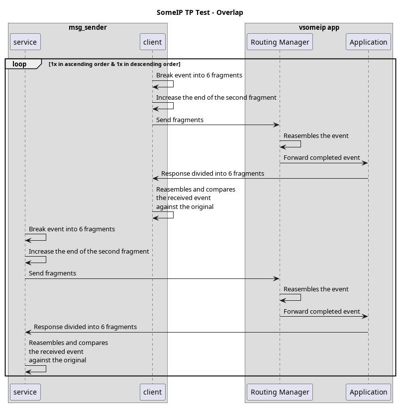
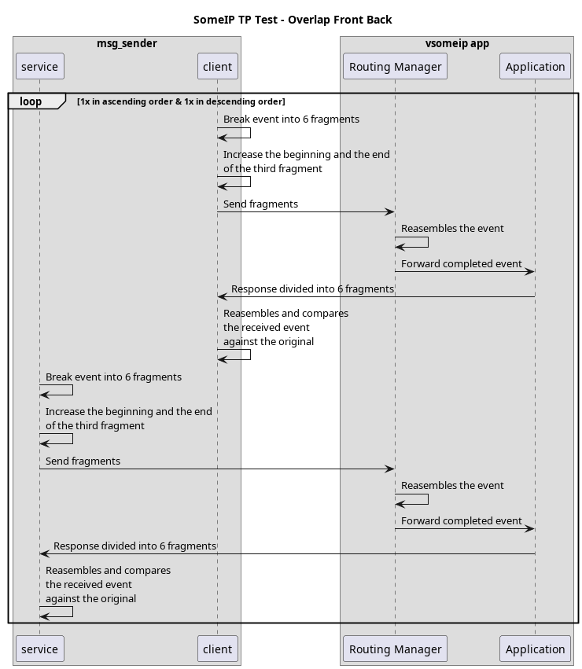

]=]´# SOME/IP Transport Protocol Tests

## Overview

The `someip_tp_tests` are designed to validate the SOME/IP Transport Protocol layer implementation.
The TP layer handles fragmentation and reassembly of large SOME/IP messages
that exceed the maximum UDP payload size (1400 bytes), ensuring reliable transmission over UDP.

### Test

The test involves two actors:

- **Master**: Acts as both client and service, initiating requests and sending events
- **Slave**: Acts as both service and client, responding to requests and receiving events

The test validates bidirectional communication where:

1. Slave sends a large fragmented UDP request to Master
2. Master echoes the request back as a response
3. Master sends a fragmented UDP request to Slave
4. Slave echoes the request back as a response
5. Master sends fragmented events to Slave
6. Slave receives and validates the events

### Test Preparation

To ensure SOME/IP-TP operates correctly, the TP message IDs must be declared explicitly.
The TP layer only segments and transmits messages whose service/instance/method IDs appear
in vsomeip's configuration. Any oversized message not listed there is dropped.

Two TP directions are defined:

- **service-to-client**: Defined as [4545.8001].
- **client-to-service**: Defined as [6767.8001].

These enable SOME/IP-TP to fragment messages that exceed the UDP size limit.

We also define the maximum allowed payload size for unreliable (UDP-based) SOME/IP messages before segmentation becomes necessary. For the tests we set `max-payload-size-unreliable` to 8352 bytes and messages are intentionally crafted to exceed this threshold to trigger the fragmentation.

### Test Execution

Each test variant runs twice:

1. **Ascending order**: Fragments sent in sequential order (0, 1, 2, 3, 4, 5)
2. **Descending order**: Fragments sent in reverse order (5, 4, 3, 2, 1, 0)

## Test Variants

There are 6 test variants, each targeting specific aspects of the TP layer:

### In-Sequence

Validates basic fragmentation and reassembly with correctly ordered fragments.

**Expected Behavior**:

- All fragments received correctly
- Response matches original request exactly

Sequence Diagram

### Mixed

Tests fragment reassembly with out-of-order delivery.

**Expected Behavior**:

- TP layer correctly reorders fragments by offset
- Returned message matches original despite out-of-order delivery

Sequence Diagram

### Incomplete

Tests handling of incomplete or abandoned fragment sequences.

**Expected Behavior**:

- Incomplete fragments are properly discarded
- TP layer cleans up abandoned sessions
- Complete messages are processed correctly despite prior incomplete sequences

Sequence Diagram

### Duplicate

Tests handling of duplicate fragments.

**Expected Behavior**:

- Duplicate fragments are identified and ignored
- Only unique fragments are used in reassembly
- Final message contains no duplicate data

Sequence Diagram

### Overlap

Tests handling of fragments where segments overlap (one segment is "larger" at the end)

**Expected Behavior**:

- Overlapping regions are handled correctly
- Message integrity is maintained despite overlaps

Sequence Diagram

### Overlap Front Back

Tests handling of fragments with overlaps at both ends.

**Expected Behavior**:

- Front and back overlaps are resolved correctly
- Fragment boundaries are properly maintained

Sequence Diagram

