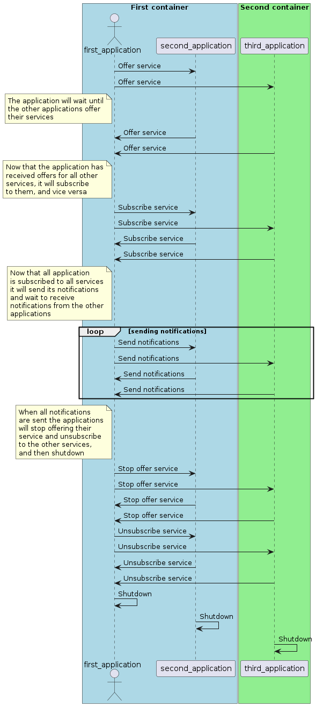

# Subscribe notify test diff client

This test tests if events are correctly sent and received by multiple
applications that each provide their service and wait to receive notifications
from all the other services, that are offered by the other applications,
half running on the same container, half running on a different container
from the application in question. Each application will register and offer
one service, unique for each application. That service will begin to notify
as soon as all the other applications have subscribed to it, and will notify
10 times, after which the application will stop offering the service. At the
same time, each application will subscribe to all the other services and will
wait to receive all the 10 notifications for each of the services offered by
the other applications, after which it is ready to shutdown. The shutdown will
happen when the application has sent all the notifications for the service
that it is offering and has received all the notifications sent by the other
services.

## Purpose

- Ensure that when an application both offers a service
and is subscribed to other services it is able to send
its notifications and receive the notifications sent
by other applications.
- Ensure that all applications send and receive the
notifications under different circumstances, such as
sending the notifications via tcp or udp or both,
all the services sending the notifications on the
same port, on completely different ports or some
services on the same port and some on different ports.

## Test Logic

### Application

Each application will begin by registering to
the routing manager if it is not routing host,
given that in this test there is no routing manager
present and one of the applications will be the routing
host. After the application is registered, it will offer
its service, while waiting to receive the offers for
the other services via a availability handler that it
has registered. After receiving all the availabilities,
it will finally subscribe to each of the services offered
by the other applications. After it has subscribed to
all the services, it will begin to send the notifications
for the service that it offers, while also receiving the
notifications sent by the other applications. After it
has received all the notifications from the other
applications, it will wait to send all of its notifications
if they have not been sent yet. After this, it will send
stop offers for its service and after this unsubscribe
from the services offered by the other applications.
After this is done, the application will shutdown and
the test will end.
