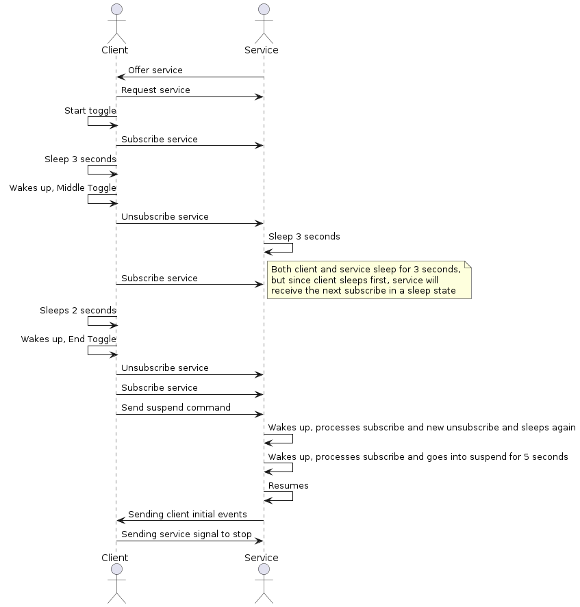

# Suspend resume test

This test ensures that after a service provider application resumes
after being in a suspend state the initial events for the events that
it is offering are correctly sent. This is done by the client controlling
the service application state via subscribes and unsubscribes to the service
that it offers.

## Purpose

- Ensure that a service sends the initial events after waking up from suspend

## Test logic

### Service provider

The service provider offers a service that is subscribed by the client.
When it receives an unsubscribe from the client the service sleeps for
3 seconds. Also, it can receive messages from the client to either enter
a suspend state or to end the test.

### Service consumer (client)

The client initially subscribes to the service that is provided.
After that, it sends a succession of subscribes and unsubscribes,
while sleeping in between, to guarantee that the service provider
processes correctly the subscribes and unsubscribes received while
the service application sleeps, since it enters sleep after receiving
an unsubscribe from the client. After this, the client sends a suspend
command to the service while it is subscribed to the service to check
if the initial notifications for the service are correctly sent after
the service application wakes up after suspend.
