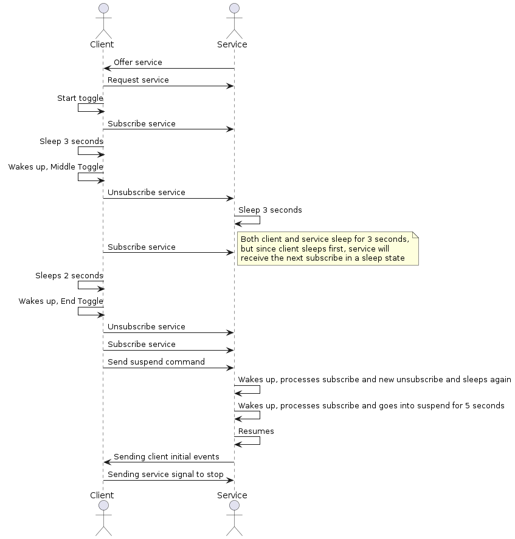
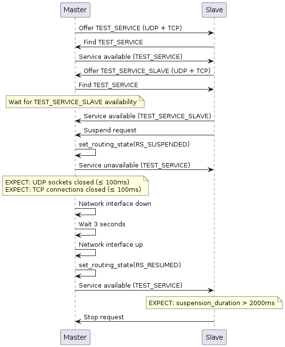

# Suspend resume tests

## suspend_resume_test

This test ensures that after a service provider application resumes
after being in a suspend state the initial events for the events that
it is offering are correctly sent. This is done by the client controlling
the service application state via subscribes and unsubscribes to the service
that it offers.

### Purpose

- Ensure that a service sends the initial events after waking up from suspend

### Test logic

#### Service provider

The service provider offers a service that is subscribed by the client.
When it receives an unsubscribe from the client the service sleeps for
3 seconds. Also, it can receive messages from the client to either enter
a suspend state or to end the test.

#### Service consumer (client)

The client initially subscribes to the service that is provided.
After that, it sends a succession of subscribes and unsubscribes,
while sleeping in between, to guarantee that the service provider
processes correctly the subscribes and unsubscribes received while
the service application sleeps, since it enters sleep after receiving
an unsubscribe from the client. After this, the client sends a suspend
command to the service while it is subscribed to the service to check
if the initial notifications for the service are correctly sent after
the service application wakes up after suspend.

---

## suspend_resume_test_connections

This test ensures that when the routing manager (master) transitions to a
suspended state, all external UDP and TCP sockets bound to the network
interface are properly closed, and that after resume the service becomes
available again within the expected time window.

### Purpose

- Ensure that all external UDP and TCP connections are closed when
  `set_routing_state(RS_SUSPENDED)` is called
- Ensure that the service becomes unavailable on suspend and available again
  on resume and confirm the StopOffer was sent on suspend (not deferred to resume)

### Test logic

#### Master (routing manager)

The master offers `TEST_SERVICE` (with a field event) over UDP and TCP and
requests `TEST_SERVICE_SLAVE` from the slave.
On receiving a suspend request from the slave, the master calls
`set_routing_state(RS_SUSPENDED)` and immediately verifies that all UDP
sockets and TCP connections on the boardnet are closed. It then brings the
network interface down, waits 3 seconds, brings it back up, and calls
`set_routing_state(RS_RESUMED)`.

#### Slave

The slave requests `TEST_SERVICE` from the master and offers
`TEST_SERVICE_SLAVE` (UDP + TCP) to ensure active connections exist before
the suspend sequence begins. Once `TEST_SERVICE` is available, it sends a
suspend request to the master and then waits for the service to become
unavailable and subsequently available again. It asserts that the duration
between unavailability and re-availability exceeds 2000 ms, confirming that
the StopOffer was issued on suspend rather than only on resume. Finally,
it sends a stop request to terminate the test.
